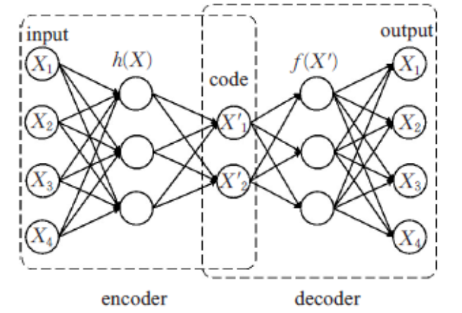
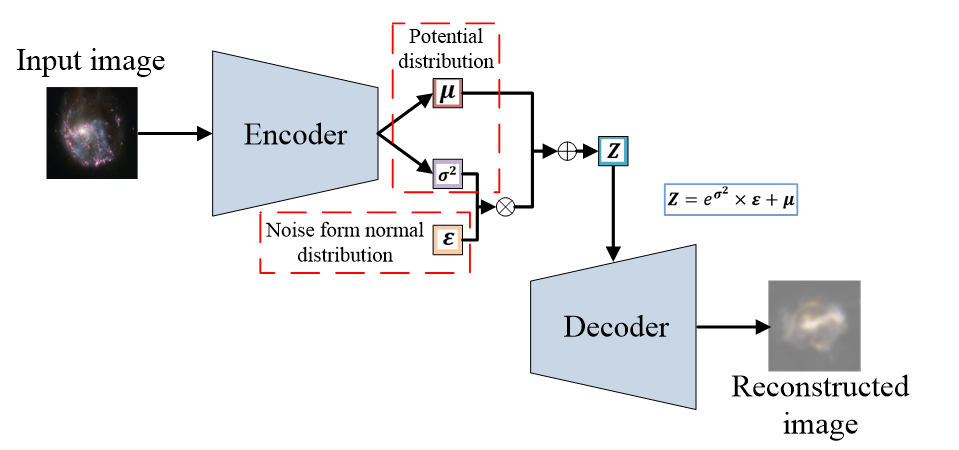
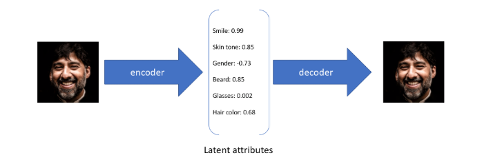
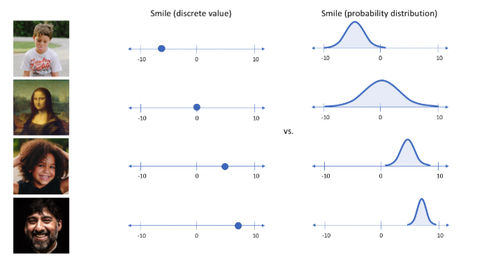
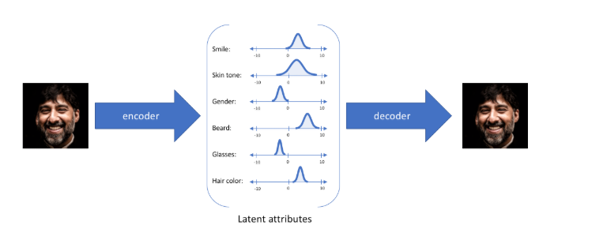
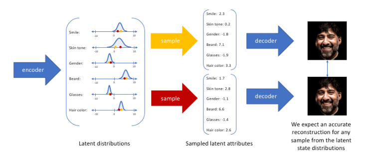

# VAE 模型解析

变分自编码器 (Variational Autoencoder, VAE) 完整实现
用于理解 VAE 的基本原理，包含模型定义、训练和推理。

### 核心原理简述：

VAE 与普通自编码器(AE)不同，它假设隐变量 z 服从某个先验分布（通常为标准正态），
并通过两个网络：
  - 编码器(Encoder)：将输入 x 映射为隐空间分布的参数 μ 和 σ
  - 解码器(Decoder)：从隐变量 z 重构输入 x̂

训练目标（ELBO）：
  L = E_q(z|x)[log p(x|z)] - KL(q(z|x) || p(z))
     = 重构损失                     - KL散度

其中：
  - 重构损失：衡量解码器从 z 还原 x 的能力
  - KL散度：约束 q(z|x) 接近先验 p(z)=N(0,I)，使隐空间具有良好的结构

部分引用自：https://www.cnblogs.com/myleaf/p/18682945

首先AE是自编码器（Auto-Encoder），VAE是变分自编码器（Variational Auto-Encoder）

什么是变分？
~~~
因为KL散度实际上是一个泛函，要对泛函求极值就要用到变分法
当然这里的变分法只是普通微积分的平行推广，还没涉及到真正的变分法
而VAE的变分下界，是直接基于KL散度得到的。
~~~
第一次看，感觉听不太懂，先往下看，到后面自然就懂了

### 整体结构

编码器就是想把一个物体投到隐空间，相当于编码的过程，提取输入的特征，用向量的形式表征出来，便于运算。

普通编码器结构：

VAE的结构：

### 主要目的
假设任何人像图片都可以由表情、肤色、性别、发型等几个特征的取值来唯一确定，那么我们将一张人像图片输入自动编码器后将会得到这张图片在表情、肤色等特征上的取值的向量X’，而后解码器将会根据这些特征的取值重构出原始输入的这张人像图片。

但如果输入蒙娜丽莎的照片，将微笑特征设定为特定的单值（相当于断定蒙娜丽莎笑了或者没笑）显然不如将微笑特征设定为某个取值范围（例如将微笑特征设定为x到y范围内的某个数，这个范围内既有数值可以表示蒙娜丽莎笑了又有数值可以表示蒙娜丽莎没笑）更合适，于是：

就可以把确定的事件描述为概率分布：

然后最后再采样得到所谓的latent变量Z

### 损失函数
vae的loss函数为两项，重构损失(reconstruct loss)以及kl散度正则项(kl loss)，分别对应模型训练过程希望达成的两个目的。

#### 重构损失：希望vae生成的结果和输入之间的差异比较小
#### KL散度正则化，希望编码器生成的隐变量尽可能符合标准正态分布