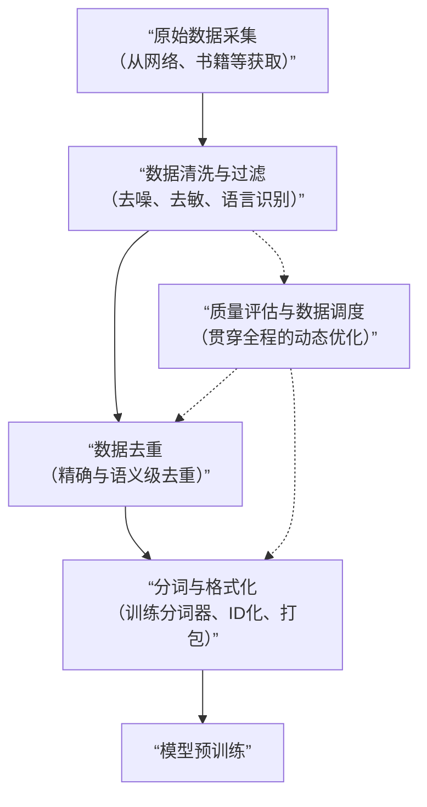

# 如何做数据准备

为大语言模型准备预训练数据，是一个将海量、杂乱的原始文本，加工成高质量、结构化训练语料的系统工程。其核心目标是为模型提供充足、多样且干净的信号，让它从中学习语言的规律和世界知识。

整个过程通常可以分为以下四个关键环节：

下面我们来详细拆解每一个步骤。

### 📥 第一步：原始数据采集

这一步的目标是建立一个庞大且多样化的语料库，为模型提供全面的知识覆盖。

-   **数据来源**：尽可能多样化，包括**网页文本、书籍、学术论文、代码库、新闻报道、论坛帖子**等。一个顶级模型的训练集规模在2025年已可超过**100万亿token**。
-   **采集方式**：
    -   **公开数据爬取**：需遵守网站的`robots.txt`协议，进行礼貌、合法的爬取。
    -   **授权与购买**：与数据提供商合作，获取高质量、结构化的数据。
    -   **合成数据**：利用现有数据，通过特定方法生成新的、多样化的数据变体，以补充某些领域的不足。

### 🧹 第二步：数据清洗与过滤

原始数据充满噪声，必须进行精细的清洗，以保证训练信号的纯净。

-   **基础清洗**：
    -   **编码统一**：将所有文本统一为UTF-8编码，修复乱码（如将"é"修复为"é"）。
    -   **格式清理**：移除HTML标签、控制字符，标准化空白符。
    -   **内容净化**：过滤掉广告、 inappropriate内容以及隐私信息。
-   **高级过滤**：
    -   **语言识别**：根据模型目标，筛选或识别出特定语言的文本。
    -   **质量筛选**：
        -   **启发式规则**：过滤掉包含过多特殊字符、重复标点或URL的文本。例如，如果非字母数字字符超过50%，则丢弃该样本。
        -   **基于模型的方法**：训练一个文本分类器，自动判别文本的质量高低。
    -   **语义清洗**：更先进的流程会检测并剔除那些无意义、逻辑矛盾或上下文不连贯的文本。有研究表明，针对性地去除一些对任务贡献不大的词（如基于TF-IDF评分），可以在保持甚至提升模型性能的同时，将训练时间**缩短高达17%**。

### ♻️ 第三步：数据去重

重复的数据会让模型产生偏见和记忆，损害其泛化能力，因此去重是提升数据质量的关键一步。

-   **去重级别**：
    -   **精确去重**：删除完全相同的文本段落。
    -   **近似去重**：删除高度相似的内容。常用算法包括**MinHash**和**SimHash**，它们通过生成文本的“指纹”来快速找出相似文档。
    -   **语义去重**：这是2025年的先进技术，通过将文本表示为向量，在语义层面检测并移除内容相同但表达方式不同的重复数据。
-   **技术实现**：
    -   **MinHash + LSH (局部敏感哈希)**：这是一种经典的组合策略。先为每个文档生成MinHash签名，再通过LSH将签名相似的文档映射到同一个“桶”中，从而实现高效的大规模近似去重。

### 🔢 第四步：分词与格式化

这是将清洗后的文本转化为模型可以理解的数字形式的最后一步。

-   **训练分词器 (Tokenizer)**：
    -   **目的**：分词器将文本切分成模型词汇表中的基本单元（Token）。常见的算法有**BPE（Byte Pair Encoding）**、**WordPiece**等。
    -   **实践**：你需要在你的大规模语料上训练一个新的分词器，或者直接使用成熟模型（如BERT、LLaMA）配套的分词器。例如，使用Hugging Face的`tokenizers`库可以很方便地训练一个BPE分词器。
-   **构建训练样本**：
    -   **对于像GPT这样的Decoder-only模型**：核心任务是“因果语言建模”，即根据上文预测下一个词。因此，数据通常被组织成连续的文本块，模型的目标就是预测每个位置的下一个Token。
    -   **ID化与打包**：将切分好的Token序列映射为对应的数字ID。最终，所有文本的ID被写入一个二进制文件（如`.bin`），并附带一个索引文件（如`.idx`）来记录每个样本的起始位置，以便训练时高效读取。

### ✨ 进阶趋势：全流程的质量评估与动态调度

在2025年，顶尖的预训练数据准备已不再是一个线性的、一次性的流程。一个更先进的系统会在全流程中引入**质量评估与动态数据调度**。

这意味着会有专门的机制持续评估数据的质量和多样性，并动态地调整不同数据源在训练时的采样比例，确保模型始终能从最优质、最合适的数据中学习。例如，一些研究正在探索如何设计更好的嵌入模型，来精确衡量数据点之间的相似性，从而指导更优的数据选择策略。

希望这份梳理能帮助你全面理解预训练数据准备的完整流程。如果你对其中某个具体环节（例如如何使用MinHash进行去重）感兴趣，我可以为你提供更详细的解释或代码示例。