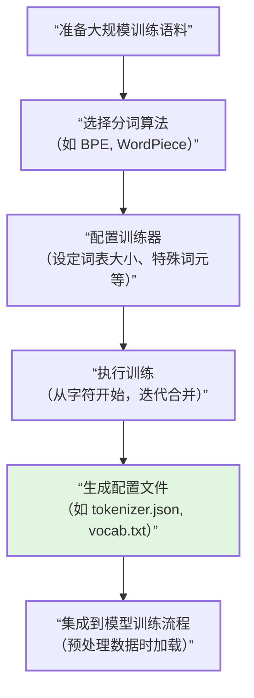

# 如何搭建一个分词器

搭建一个分词器，就像是给大语言模型（LLM）准备一套它专用的“字母表”和“组词规则”。这套系统决定了模型如何看待和理解文本，是预训练工作中非常关键的一步。

整个过程可以分为两大核心步骤：**一是确定采用何种算法（选择哪套“组词逻辑”）**，**二是用你的语料去“训练”它，让它从数据中学习出这套规则**。

下面这张流程图可以帮你快速建立起一个整体的框架认知：



接下来，我们结合当前主流的实践方法，详细拆解搭建流程。

### 🧬 第一步：选择核心算法

在开始训练前，你需要决定采用哪种分词算法。目前，LLM领域最主流的是**字节对编码（Byte Pair Encoding, BPE）**，而像BERT这类早期模型则常用**WordPiece**。它们在理念上稍有不同：

-   **BPE (Byte Pair Encoding)**：从一个一个的字符开始，反复统计并合并语料中出现频率最高的相邻字符对（如 `("a", "b")` 合并成 `"ab"`），直到词表大小达到你的目标。它的目标是**压缩数据**。
-   **WordPiece**：同样是从字符开始合并，但它选择合并的标准不是“频率”，而是看哪个合并能最大程度地增加训练语料的**概率似然**（即让整个语料被当前词表表示出来的可能性变得最大）。这是一种更“优雅”但计算稍复杂的选择。

> 对于大多数现代的GPT系列模型，**BPE**是你的不二之选。

### 🛠️ 第二步：使用Hugging Face Tokenizers库进行训练

这是目前最流行、最高效的方法。`tokenizers`库用Rust编写，训练速度非常快。我们以训练一个BPE分词器为例，演示核心流程。

#### 📥 1. 准备训练语料

你需要一个大型的文本语料库，最好是纯文本格式（`.txt`）或一行一个JSON对象的格式（`.jsonl`）。你可以像下面这样，从Hugging Face Datasets库加载一个经典的数据集作为示例：

```python
from datasets import load_dataset

# 加载WikiText-103数据集作为示例
dataset = load_dataset("wikitext", "wikitext-103-raw-v1", split="train")

# 创建一个生成器，逐批产生文本，以节省内存
def get_training_corpus():
    for i in range(0, len(dataset), 1000):
        yield dataset[i : i + 1000]["text"]
```

#### ⚙️ 2. 配置并训练分词器

接下来，我们实例化一个BPE分词器，并配置它的“流水线”。一个完整的分词流程通常包括：**归一化**（清理文本，如转小写） -> **预分词**（初步分割，如按空格） -> **模型**（核心的BPE算法） -> **后处理**（添加特殊词元）。

```python
from tokenizers import Tokenizer, models, pre_tokenizers, trainers, decoders, processors

# 1. 初始化一个BPE模型
tokenizer = Tokenizer(models.BPE())

# 2. 设置预分词规则：按空格和标点分割（GPT-2风格）
tokenizer.pre_tokenizer = pre_tokenizers.ByteLevel(add_prefix_space=True)

# 3. 创建训练器，并指定目标词表大小和特殊词元
# 特殊词元（如 [UNK], [PAD], [CLS], [SEP], [MASK]）需要在这里指定，否则它们不会被加入到词表中
trainer = trainers.BpeTrainer(
    vocab_size=32768,  # 目标词表大小，例如32k
    special_tokens=["<|endoftext|>", "<|pad|>"], # 根据模型需求定义特殊词元
    min_frequency=2,   # 一个词对至少出现2次才考虑合并
    show_progress=True
)

# 4. 开始训练！使用我们之前定义的生成器
tokenizer.train_from_iterator(get_training_corpus(), trainer=trainer)

# 5. （可选）设置解码器，使解码后的文本看起来更自然
tokenizer.decoder = decoders.ByteLevel()
```

#### 💾 3. 保存与加载

训练完成后，将分词器保存为一个JSON文件，以后就可以随时加载使用了。

```python
# 保存分词器
tokenizer.save("my_custom_bpe_tokenizer.json")

# 加载分词器
from tokenizers import Tokenizer
new_tokenizer = Tokenizer.from_file("my_custom_bpe_tokenizer.json")

# 测试一下
output = new_tokenizer.encode("Hello, how are you?")
print(output.tokens)  # 查看分词结果
print(output.ids)     # 查看对应的ID
```

### 🧪 第三步：集成到模型训练框架

有了训练好的分词器，下一步就是用它来预处理你的海量训练数据。像NVIDIA NeMo这样的框架提供了现成的脚本，可以高效地将你的文本语料（如`train_data.jsonl`）转换成模型训练时可直接读取的、预先分词好的“内存映射”格式（`.mmap`或`.bin`）。

以NeMo为例，使用SentencePiece分词器训练后的模型文件进行预处理的命令大致如下：

```bash
python <NeMo_ROOT>/scripts/nlp_language_modeling/preprocess_data_for_megatron.py \
    --input=train_data.jsonl \
    --json-keys=text \
    --tokenizer-library=sentencepiece \
    --tokenizer-model=spm_32k_wiki.model \  # 你训练好的分词器模型文件
    --output-prefix=gpt_training_data \
    --append-eod \
    --workers=32
```

### 💡 核心要点总结

-   **算法选择**：对于大多数LLM，**BPE**是主流选择；对于BERT这类双向模型，**WordPiece**更合适。
-   **工具选择**：**Hugging Face Tokenizers** 库是训练自定义分词器的首选，它快速且功能全面。
-   **关键配置**：训练时务必指定`vocab_size`（词表大小）和`special_tokens`（特殊词元）。词表大小通常在**32k**到**100k**之间，根据你的模型规模和语言复杂度决定。
-   **完整流程**：不要只训练一个模型文件。你需要将训练好的分词器应用到整个训练语料上，将其转换成模型可以高效读取的格式（如MMAP），这一步通常在数据预处理脚本中完成。
-   **开箱即用方案**：如果你想快速尝试，也可以选择复用成熟模型（如GPT-2、LLaMA）的分词器，或者使用Andrej Karpathy的 `minbpe` 项目来学习BPE的精简实现。