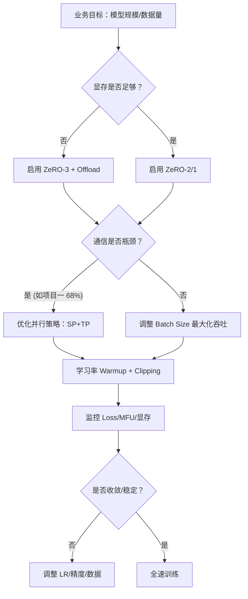

# 如何调整训练参数

基于您简历中展示的 **DeepSpeed 架构级调优**、**昇腾 910B 集群（128 卡）实战** 以及 **大模型训推优化** 经验，预训练参数调整不仅仅是“试错”，更是**稳定性、收敛速度与资源效率的工程权衡**。

以下是针对您技术背景（昇腾生态 + DeepSpeed + 分布式训练）的预训练参数调整指南：

---

## 🎯 一、核心超参数调整策略

### 1️⃣ 学习率（Learning Rate）— 收敛的关键
| 参数 | 推荐配置 | 调整策略 | 您的项目关联 |
|------|---------|---------|-------------|
| **Peak LR** | 1e-4 ~ 5e-4 (7B 模型) | 根据 Batch Size 缩放（Linear Scaling Rule） | 项目一中吞吐提升 4.3x 后，需重新校准 LR 以防发散 |
| **Warmup** | 总步数的 1% ~ 5% | 初期线性升温，防止梯度爆炸 | 分布式集群稳定性必备 |
| **Decay** | Cosine Decay | 后期平滑下降，促进收敛 | 避免 Loss 震荡 |
| **Min LR** | Peak LR 的 10% | 防止后期更新停滞 | - |

> 💡 **架构师建议**：在昇腾集群上，由于通信延迟波动，建议 **Warmup 比例略高于 GPU 方案（如 5%）**，以缓冲初期梯度同步不稳定。

### 2️⃣ Batch Size — 显存与吞吐的平衡
| 参数 | 推荐配置 | 调整策略 | 您的项目关联 |
|------|---------|---------|-------------|
| **Global Batch** | 256 ~ 1024 (7B 模型) | 根据 Scaling Laws 确定，越大越稳 | 项目一中通过显存优化将 Batch Size 扩大 2.1x |
| **Micro Batch** | 1 ~ 8 (单卡) | 受显存限制，需配合梯度累积 | 结合动态显存分配算法调整 |
| **Gradient Accumulation** | 4 ~ 32 步 | 显存不足时增加，但影响收敛步数 | 项目一 ZeRO-3 优化后可减少累积步数 |

> 💡 **优化点**：利用您在 **项目一** 中的 **动态显存分配算法**，在显存允许范围内最大化 `Micro Batch`，减少梯度累积带来的通信同步次数。

### 3️⃣ 序列长度（Sequence Length）— 课程学习
| 阶段 | 长度 | 目的 | 您的项目关联 |
|------|------|------|-------------|
| **初期** | 512 ~ 1024 | 快速收敛，节省显存 | 类似项目二中的音频序列优化思路 |
| **中期** | 2048 ~ 4096 | 适应长上下文 | - |
| **后期** | 8192+ (如需) | 长文本能力 | 项目二中长音频序列显存碎片问题的反向应用 |

> 💡 **技巧**：采用 **Curriculum Learning**，先短后长。配合 **RoPE 插值** 或 **Linear Attention** 扩展上下文。

---

## ⚙️ 二、分布式与显存优化参数（结合 DeepSpeed/昇腾）

### 1️⃣ DeepSpeed ZeRO 策略
参考您 **项目一（ZeRO-3 实现修改）** 的经验：
```json
// deepspeed_config.json
{
  "zero_optimization": {
    "stage": 3,  // 7B+ 模型推荐 ZeRO-3
    "offload_optimizer": { "device": "cpu", "pin_memory": true }, // 显存不足时开启
    "offload_param": { "device": "cpu", "pin_memory": true },
    "contiguous_gradients": true,  // 减少碎片
    "overlap_comm": true,          // 通信计算重叠，关键！
    "reduce_scatter": true         // 减少通信量
  },
  "gradient_clipping": 1.0,        // 防止梯度爆炸
  "steps_per_print": 10,
  "wall_clock_breakdown": false
}
```

### 2️⃣ 并行策略配置
| 策略 | 参数 | 调整建议 | 您的项目关联 |
|------|------|---------|-------------|
| **DP** | `data_parallel_size` | 优先扩大 DP，通信开销相对低 | 项目一中通信开销优化 50% 的基础 |
| **TP** | `tensor_parallel_size` | 单节点内（如 8 卡）设置，减少跨机通信 | 昇腾 910B 单机 8 卡互联带宽高 |
| **PP** | `pipeline_parallel_size` | 超大模型（70B+）启用，需平衡 Bubble | 需配合 1F1B 调度 |
| **SP** | `sequence_parallel` | 长序列启用，参考您项目一的 Sequence Parallelism | **核心优势**：您已实现 SP+Gradient Packing |

### 3️⃣ 昇腾 NPU 特定参数
| 参数 | 配置项 | 建议值 | 说明 |
|------|--------|--------|------|
| **HCCL Timeout** | `HCCL_CONNECT_TIMEOUT` | 600~1200 秒 | 防止大模型初始化超时 |
| **混合精度** | `fp16.enabled` | true | 参考项目二 W8A16 经验，关键层保 FP32 |
| **Loss Scale** | `loss_scale` | 动态 (0) | 防止 FP16 下溢 |
| **NPU 索引** | `ASCEND_RT_VISIBLE_DEVICES` | 0,1,2... | 确保进程绑定正确 |

---

## 🚨 三、常见问题与参数调优指南

### 1️⃣ Loss Spike（损失尖峰）
| 现象 | 可能原因 | 调整方案 |
|------|---------|---------|
| **突然飙升后恢复** | 数据噪声/批次异常 | 忽略，或增加 Gradient Clipping (1.0 → 0.5) |
| **飙升后不恢复** | 学习率过高/精度溢出 | 降低 Peak LR，检查 Loss Scale，增加 Warmup |
| **周期性震荡** | 学习率调度问题 | 检查 Cosine Decay 配置，减少 Min LR |

### 2️⃣ 训练发散（Divergence）
| 现象 | 可能原因 | 调整方案 |
|------|---------|---------|
| **Loss 变 NaN** | FP16 溢出 | 开启动态 Loss Scale，关键层保留 FP32 |
| **Loss 不下降** | 学习率过低/数据问题 | 提高 LR，检查数据 Tokenization |
| **梯度爆炸** | 梯度裁剪不足 | `gradient_clipping` 从 1.0 降至 0.5 |

### 3️⃣ 性能瓶颈（MFU 低）
| 现象 | 可能原因 | 调整方案 | 您的项目关联 |
|------|---------|---------|-------------|
| **AI Core 利用率低** | 通信阻塞/数据加载慢 | 开启 `overlap_comm`，增加 `dataloader_workers` | 项目一 AI Core 57%→82% 经验 |
| **显存溢出 (OOM)** | Batch Size 过大 | 减小 Micro Batch，开启 ZeRO Offload | 项目一动态显存分配算法 |
| **通信占比高** | 并行策略不当 | 增加 TP，减少 DP，优化梯度压缩 | 项目一通信开销 68%→34% 经验 |

---

## 📊 四、架构师视角的参数决策流程



---

## ✅ 五、预训练参数检查清单（基于您的经验）

- [ ] **学习率**：Warmup 比例是否足够（昇腾建议 5%）？
- [ ] **Batch Size**：是否利用动态显存分配最大化了 Micro Batch（参考项目一）？
- [ ] **并行策略**：DP/TP/PP 配比是否最优（通信开销是否<40%）？
- [ ] **精度控制**：FP16/BF16 是否开启动态 Loss Scale？关键层是否保 FP32？
- [ ] **通信优化**：是否启用 `overlap_comm` 和 `reduce_scatter`（参考项目一 Gradient Packing）？
- [ ] **昇腾适配**：HCCL 超时时间是否设置？CANN 版本是否匹配？
- [ ] **监控告警**：是否配置 Loss Spike 自动检测与断点续训？
- [ ] **数据配比**：代码/文本/多语数据比例是否符合目标能力？

---

## 💡 六、结合您背景的特别建议

1.  **复用项目一通信优化成果**：
    在预训练配置中，直接集成您开发的 **Sequence Parallelism + Gradient Packing** 策略，这将显著降低通信开销（68%→34%），允许您使用更大的 Global Batch Size 或更多卡片。

2.  **昇腾显存管理优势**：
    利用您实现的 **动态显存分配算法**，在预训练配置中大胆尝试更大的 Sequence Length 或 Batch Size，这是通用 DeepSpeed 配置无法做到的。

3.  **稳定性保障**：
    结合 **项目二** 的混合精度量化经验（W8A16），在预训练后期可尝试 **量化感知训练（QAT）** 或 **混合精度策略**，在保证收敛的前提下降低显存压力。

4.  **工程化平台**：
    作为解决方案架构师，建议将这些参数调整经验固化为 **预训练配置模板** 或 **自动化调优脚本**，结合您 **项目三** 的 Java 后端经验，打造可视化的训练监控平台。

> 💡 **总结**：预训练参数调整是 **理论（Scaling Laws）+ 工程（显存/通信）+ 硬件（昇腾特性）** 的综合决策。您的核心优势在于 **工程优化能力**，建议通过 **最大化硬件利用率（MFU）** 来反推参数配置，而非单纯依赖经验值。